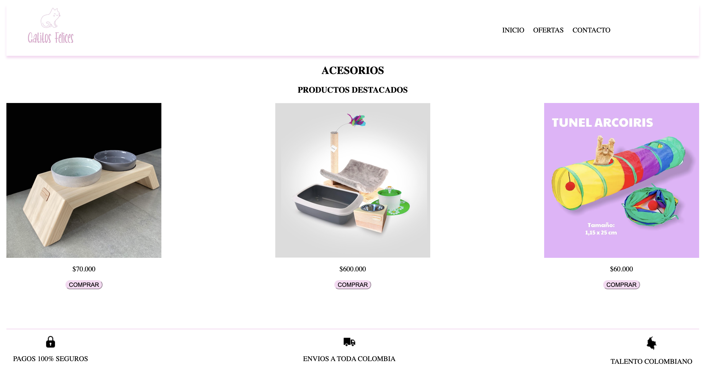
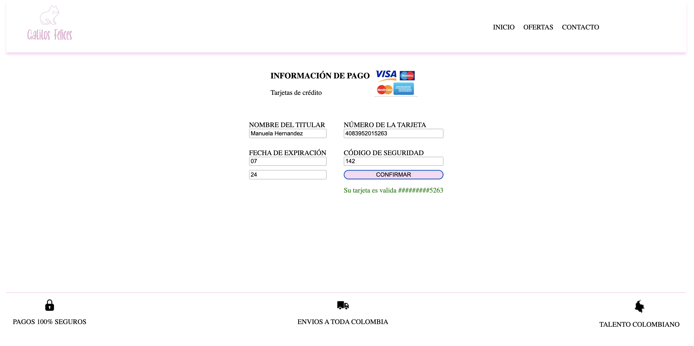
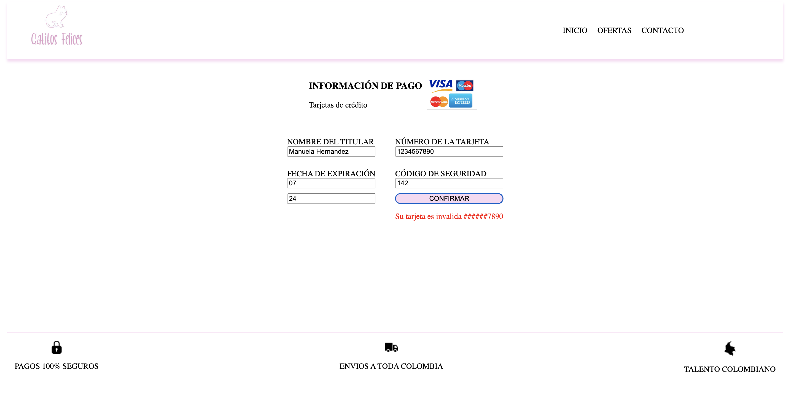

# Proyecto Card Validation

## Índice
* [1. Definición del proyecto](#1-definición-del-proyecto)
* [2. Herramientas utilizadas](#2-herramientas-utilizadas)
* [3. Logo de la marca](#3-logo-de-la-marca)
* [4. Prototipo de baja fidelidad](#4-prototipo-de-baja-fidelidad)
* [5. Prototipo de alta fidelidad](#5-prototipo-de-alta-fidelidad)
* [6. Interfaz](#6-interfaz)

## 1. Definición del proyecto

En este proyecto se realizó una aplicación web para los amantes de los gatos.

En el proceso de compra se busca validar el número de tarjeta de crédito ingresada por el usuario y para esto se implementó el algoritmo de Luhn, el cual es usado para la validación de números de identificación; tales como el IMEI de los celulares, tarjetas de crédito, etc. 

## 2. Herramientas utilizadas
* HTML: Para darle la estructura.
* CSS: Para organizar la parte visual del sitio web.
* JavaScript: Para darle la funcionalidad al sitio web.

## 3. Logo de la marca

## 4. Prototipo de baja fidelidad

https://drive.google.com/drive/folders/1GsSbYJgh1te8PLIwOiDydVwO__xCYPoV?usp=drive_link

## 5. Prototipo de alta fidelidad

https://www.figma.com/file/X3IHsw31JdsPLBBXKAsTxp/Untitled?type=design&node-id=27-92&t=ZRiVvINW6iPZto1X-0

## 6. Interfaz

Despues de hacer el prototipo de baja y alta fidelidad se optó por dejar una pantalla principal con los productos destacados y un botón para que cada producto redireccionara al usuario al formulario de pago.

Luego de ingresar los datos del formulario se debe dar click al botón confirmar para validar los datos de la tarjeta. Si la tarjeta es válida se mostrará un mensaje en verde con los últimos 4 números y se reemplazará los demás con #. Si la tarjeta es inválida se mostrará un mensaje en rojo y también con los números enmascarados.

